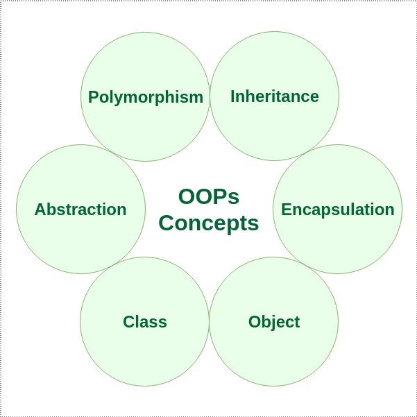

# OOPS
In this Concept we need to understand two major Ways

## 1. Contructor and Destructor
## 2. Oops 

## Under Constructor and Destructor
-  Classes and Objects
-  Constructor
-  Constructor Overloading
-  Destructor
-  Access Modifiers
-  Encapsulation
-  Friend function and Friend Classes

## Under Oops
- Classes and Objects (basic structure, constructors/destructors)
- Encapsulation (access specifiers, getter/setter)
- Inheritance (single, multiple, multilevel)
- Polymorphism (compile-time and run-time)
- Virtual functions and varibles
- Abstract classes and interfaces
- Operator Overloading
- Composition vs Inheritance
- Best practices and common pitfalls

 
Understand the Basic structure of Class and Objects: class.cpp

Basic Constructor: 1constr.cpp

