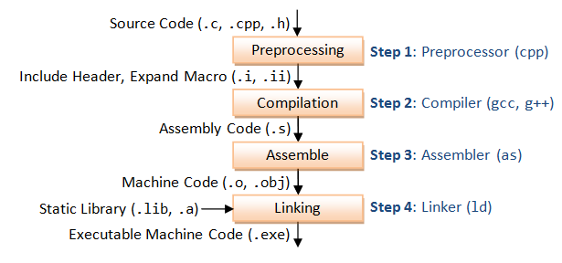

Learn in the following order..
1. Understand the extension .c, .cpp and .h, .hpp

2. Understand the build process (Code to Machine understanding language)

3. main.cpp - > Pre-precessor -> Compiler -> Assembler -> Linker

     

4. Commands

    1️⃣  Preprocessing (Expands macros, includes headers)

    ```c++
    g++ -E program.cpp -o program.i
    ```
    2️⃣ Compilation (Converts preprocessed code to assembly)

    ```c++
    g++ -S program.i -o program.s
    ```

    3️⃣ Assembly (Converts assembly to machine code)

    ```c++
    g++ -c program.s -o program.o
    ```

    4️⃣ Linking (Generates final executable)
    
    ```c++
    g++ program.o -o program
    ```
    Additional :
    ```c++
    g++ -Wall program.cpp -o program
    ```
    ```c++
    g++ -std=c++17 program.cpp -o program
    ```

5. Compilation with Library
    ```c++
    g++ program.cpp -o program -lm
    ```

6.  Linking a Shared Library (.so)
    ```c++
    g++ program.cpp -o program -L/path/to/library -lname
    ```

Example for linking libmylib.so located in /usr/local/lib:

    g++ program.cpp -o program -L/usr/local/lib -lmylib

    🔹 -L/usr/local/lib → Library path

    🔹 -lmylib → Links libmylib.so (lib prefix is omitted)

7. Linking a Static Library (.a)
    ```c++
    g++ program.cpp -o program /usr/local/lib/libmylib.a
    ```